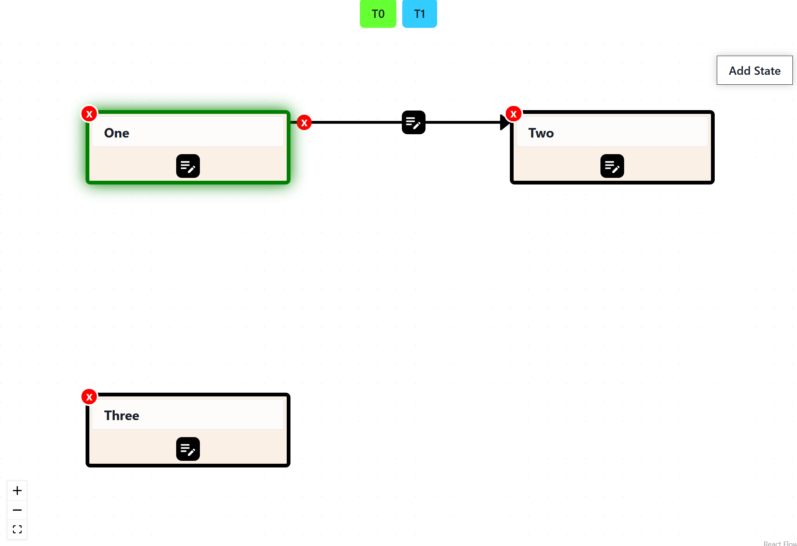

# QuickFSM Demo

This is a simple demo project for the QuickFSM component.

It creates the two buttons and the component itself with a few initial states and transitions.
The buttons can be used to trigger transisions.
If the states are configured to contain actions, their indices are printed to the console.



This project was bootstrapped with [Create React App](https://github.com/facebook/create-react-app).

## Getting started
1. Clone this repository
2. Open the demo subfolder in a terminal
3. Install project
```
npm install
```
4. Run local development server
```
npm start
```
5. Open [http://localhost:3000/](http://localhost:3000/) in a browser
